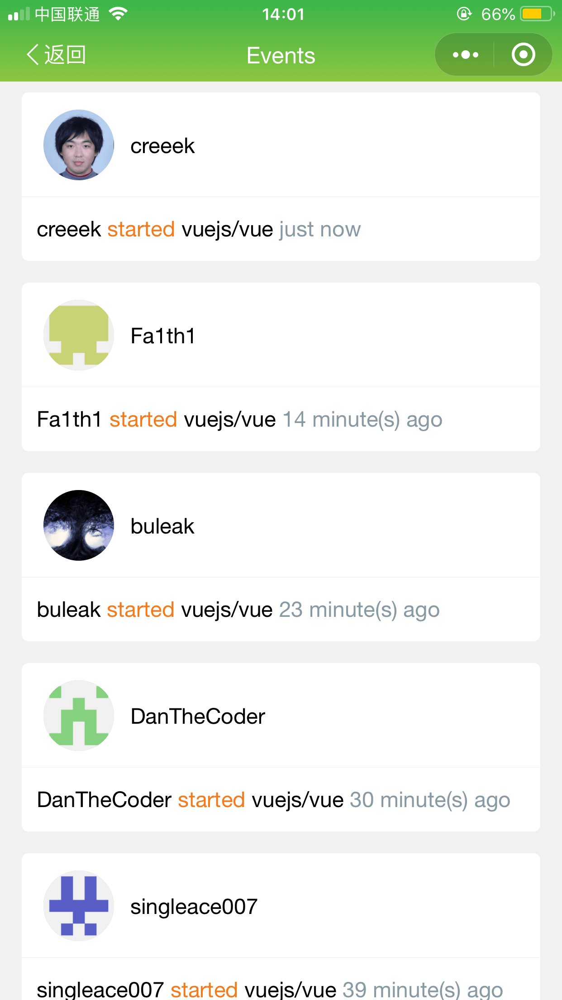

# GitPro

一款简洁、方便、美观的GitHub微信小程序客户端。

## 扫码体验


## Screenshots

<div>
    
    
    
    
    
    
</div>

## 本地运行

> 目前版本基于 `mpvue 2.x` 开发，功能完善之后开放源代码，敬请期待。

```
 # 克隆仓库
 git clone git@github.com:jsercao/GitPro.git

 # 在`project.config.json`下修改你的`appid`

 cd GitPro

 # 安装依赖
 npm i

 # 启动脚本
 npm run dev

 # 然后用微信开发者工具打开本项目根目录即可。
```

## Todo

- [x] `Contributors`展示
- [x] `Commits`展示
- [ ] `Pull requests`展示
- [ ] `watch`、`stars`、`forks`展示
- [ ] 支持`Branch`的切换查看，默认展示主分支
- [ ] 个人认证登录相关
- [ ] 支持操作`Star`、`Fork`、`Watch`功能
- [ ] 完善`markdown`的展示
- [ ] ...

## 更新日志

- v1.2.0
  - 完成【Contributors】功能
  - 完成【Commits】功能
  - fix issue icon
  - fix trending api 引起的异常
  - fix bar style

- v1.1.0
  - 支持`发现`功能，可以进行Repositories查询
  - 支持Repo的`Issues`以及`comments`的展示
  - 支持Repo的`Events`的展示

- v1.0.0
  - 支持`GitHub Trending`的展示
  - 支持查看`Repositories`的详情
  - Repo `Creator` 信息的展示
  - 支持 Repo Code 分层级查看